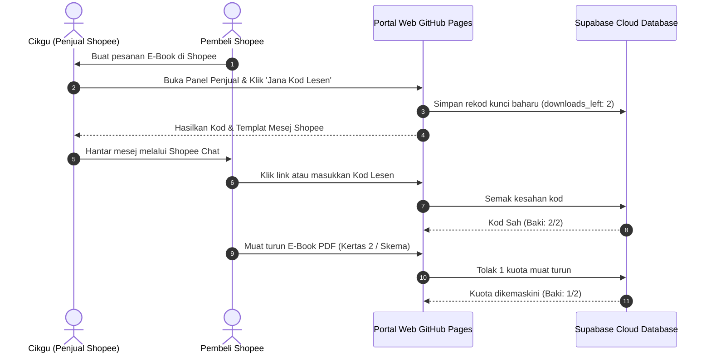

# 📚 Portal Penebusan E-Book Fizik SPM 2026 (Sistem Kod Lesen & Had 2 Kali Download)

Sistem web portal rasmi untuk jualan E-Book Shopee:
**"E-Book PDF Fizik Percubaan Negeri 2026 Topikal Kertas 2 | Jawapan Lengkap & Skema"**

Sistem ini membolehkan pembeli memasukkan **Kod Lesen**, dan hanya dibenarkan memuat turun fail sebanyak **2 kali sahaja**. Pengesahan kod disokong secara **Dalam Talian (Cloud Database)** melalui **Supabase** (Percuma) agar had 2 kali muat turun adalah 100% kalis-manipulasi dan tidak boleh di-bypass walaupun pembeli menukar peranti atau memadam *cookies/cache*.

---

## 🌟 Ciri-ciri Utama

1. **Pengesahan Awan Supabase (Online Verification)**:
   - Kod lesen disemak terus dari pangkalan data awan Supabase PostgreSQL.
   - Kiraan baki muat turun (`downloads_left`) ditolak secara *atomic* di server.
   - Apabila baki mencecah `0/2`, butang muat turun dikunci secara automatik.

2. **Panel Kawalan Penjual (Admin Suite - PIN: `1234`)**:
   - **Jana Kunci 1-Klik**: Jana kod mengikut pesanan Shopee atau jana pukal (5, 10, 20 kod serentak).
   - **Salin Templat Mesej Shopee**: 1-klik butang untuk menyalin mesej lengkap berserta pautan direct auto-tebus ke Shopee Chat pembeli.
   - **Pemantau Kunci & Reset Kuota**: Pantau baki setiap kod (`2/2`, `1/2`, `0/2`), dan boleh menambah kuota (+1) jika pembeli menghadapi masalah capaian internet.
   - **Tab Sambungan Supabase**: Uji dan simpan sambungan ke Supabase terus melalui antaramuka web.

3. **100% Serasi dengan GitHub Pages**:
   - Web ini dibina menggunakan HTML5, CSS3, dan JavaScript moden tanpa memerlukan sebarang *build step* atau server berbayar.

---

## ⚡ Langkah 1: Setup Supabase Database (Percuma & 1 Minit)

1. Pergi ke laman [supabase.com](https://supabase.com) dan daftar akaun percuma (atau log masuk dengan GitHub).
2. Klik **New Project** ➔ Berikan nama projek (cth: `fizik-ebook-portal`) ➔ Masukkan Database Password ➔ Klik **Create new project**.
3. Di menu sebelah kiri, klik **SQL Editor** ➔ **New query**.
4. Buka fail [`schema.sql`](file:///Users/halimroslan/.gemini/antigravity-ide/scratch/fizik-ebook-portal/schema.sql) dalam projek ini, salin kesemua isinya, tampal (*paste*) ke dalam SQL Editor Supabase dan klik **Run**.
5. Di menu sebelah kiri, pergi ke **Project Settings** (ikon gear di bawah) ➔ **API**:
   - Salin **Project URL** (cth: `https://abcdefghijkl.supabase.co`)
   - Salin **Project API Keys (anon public)** (cth: `eyJhbGciOiJIUz...`)
6. Buka portal di pelayar web anda ➔ Tekan **⚙️ Panel Penjual** (PIN: `1234`) ➔ Buka tab **⚡ Sambungan Supabase** ➔ Tampal URL & Key ➔ Klik **Simpan & Sambung Supabase**!

*(Nota: Anda juga boleh terus meletakkan URL & Key ini ke dalam fail `js/config.js` di bawah bahagian `APP_CONFIG.supabase`).*

---

## 🚀 Langkah 2: Publish ke GitHub Pages

### Cara Muat Naik Fail ke GitHub:
Buka Terminal anda dan jalankan arahan berikut:

```bash
cd /Users/halimroslan/.gemini/antigravity-ide/scratch/fizik-ebook-portal

# Inisialisasi Git
git init
git add .
git commit -m "Pelancaran Portal E-Book Fizik SPM 2026"
git branch -M main

# Sambungkan ke repository GitHub anda
git remote add origin https://github.com/<username-anda>/fizik-ebook-portal.git

# Push ke GitHub
git push -u origin main
```

### Cara Mengaktifkan GitHub Pages di GitHub:
1. Buka repository anda di GitHub.
2. Klik tab **Settings** ➔ Di menu kiri klik **Pages**.
3. Di bahagian **Branch**, pilih `main` dan folder `/(root)` ➔ Klik **Save**.
4. Siap! Pautan web anda akan aktif di: `https://<username-anda>.github.io/fizik-ebook-portal/`

---

## 🛍️ Cara Penggunaan Harian Apabila Ada Pembeli di Shopee



1. **Ada Order di Shopee**: Buka portal web anda.
2. **Klik "⚙️ Panel Penjual"** di penjuru atas kanan (PIN: `1234`).
3. Masukkan Order ID / Nama Pembeli ➔ Klik **"⚡ Jana Kod Lesen Baharu Sekarang"**.
4. Klik **"📋 1-Klik Salin Mesej Lengkap ke Shopee Chat"**.
5. Buka **Shopee Chat** pembeli ➔ Tekan *Paste (Ctrl+V / Cmd+V)* dan hantar.
6. Pembeli hanya perlu klik pautan berkenaan, kod akan automatik terisi, dan mereka boleh memuat turun fail PDF sebanyak **2 kali sahaja**.

---

## 📁 Struktur Fail Projek

```
fizik-ebook-portal/
├── index.html              # Antaramuka utama (Portal Pembeli + Modal Admin)
├── schema.sql              # Skrip SQL untuk setup database Supabase (1-Click Run)
├── css/
│   └── style.css           # Reka bentuk moden, glassmorphic & responsive
├── js/
│   ├── config.js           # Konfigurasi tajuk produk, fail PDF & setting Supabase
│   ├── app.js              # Logik semakan kod awan, had 2x muat turun, download PDF
│   └── admin.js            # Penjana kunci, formattter mesej Shopee, tracker Supabase
├── assets/
│   ├── ebook-fizik-percubaan-2026-kertas2.pdf   # Fail PDF Modul Soalan Kertas 2
│   └── skema-jawapan-lengkap-fizik-2026.pdf     # Fail PDF Skema Jawapan
└── README.md               # Dokumentasi lengkap
```
